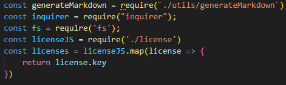
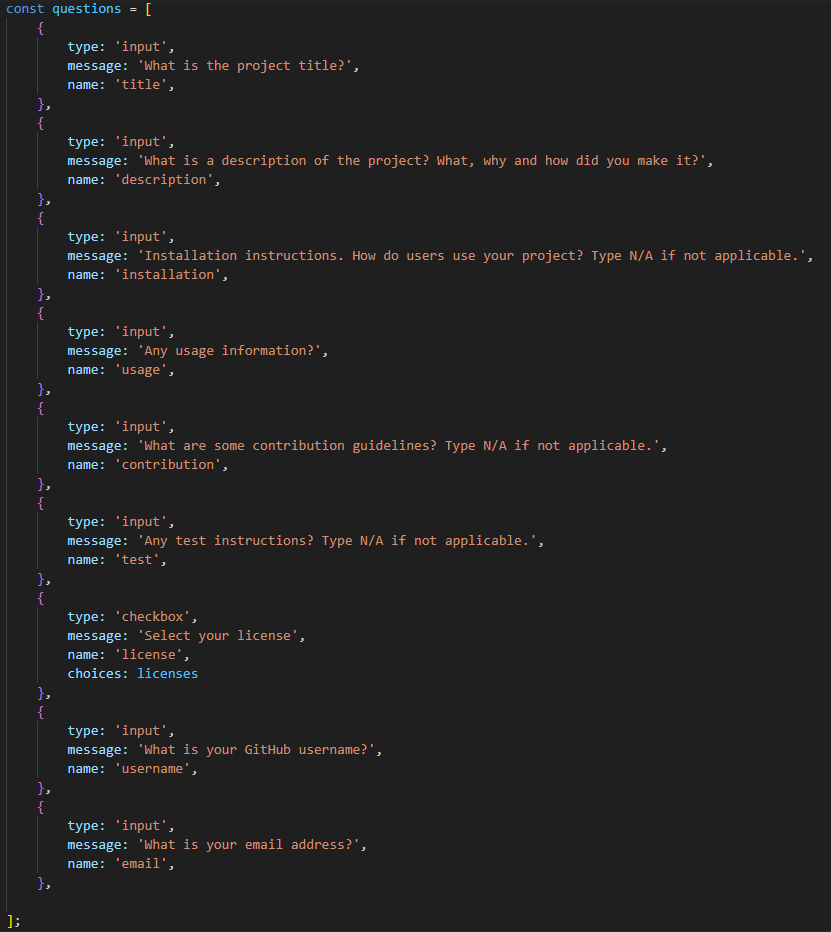
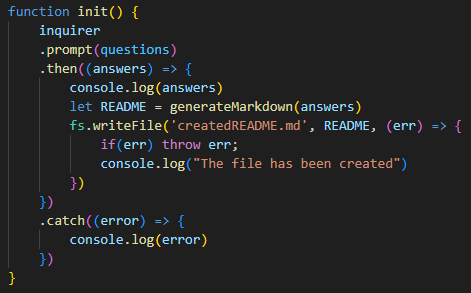
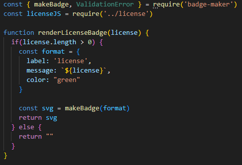
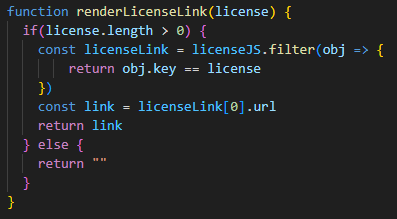
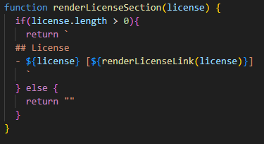
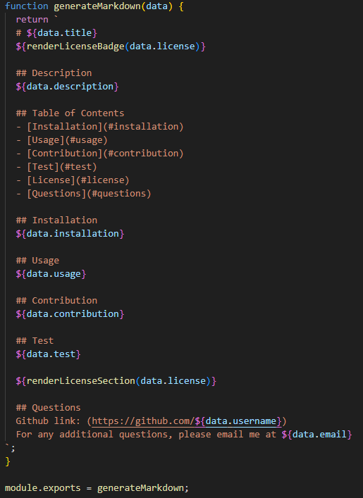

# readme-generator-nodejs

## Description

The README generator was created to create a README and plugs the user input into a template. This solves the problem of having to continously write out all the subheading by easily creating a README for projects. I learned to use JavaScript and template literals to have the function run in NodeJS. 

Video demonstration: (https://drive.google.com/file/d/1OtaERNTTFljHcGbJ12rWZEmxeuMVjj6Q/view?usp=sharing)

## Table of Contents (Optional)

If your README is long, add a table of contents to make it easy for users to find what they need.

- [Installation](#installation)
- [Usage](#usage)
- [Technologies Used](#technologies-used)
- [Credits](#credits)

## Installation

1. Have Node.js. If not, download it here. (https://nodejs.org/en)
2. Navigate to the project and type in "node index.js" in your terminal to execute the functions
3. Answer the prompts as follows
4. Your README will be generated in the file "createdREADME.md"

## Usage

This contains all the npms installed and functions used that may be located in a different file. license.js was imported from the online API so that it can be accessible offline.

This is an array of questions as objects, including the type, message presented to the user, and a title, later referenced in the template literal. The checkbox type for license allows users to check none or multiple choices.

The function prompts the questions written before, using inquirer and creates a createdREADME.md file with the template and user answers.

This function creates a badge based on the license chosen by the user. The documentation was given in the website. (https://www.npmjs.com/package/badge-maker?activeTab=readme)

The link generated goes through the license.js file to retrieve the url to display the link of the license selected by the user. 

This function puts the link together with the license formatting using backticks for the template literal of license. If there is no license selected, the license heading won't show up. If licenses are selected, the function is run under the "test" heading in the markdown.

Using the template literal, we are able to insert user input into the relevant positions. The generateMarkdown function is also exported into the index.js so that the data will be connected throughout the files.

## Technologies Used
- GitHub License API (https://api.github.com/licenses)
- badge-maker npm (https://www.npmjs.com/package/badge-maker?activeTab=readme)
- Node.js (https://nodejs.org/en)

## Credits
Tutor Joem Casusi